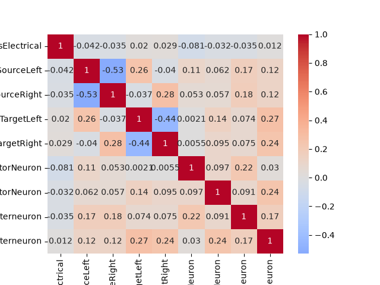
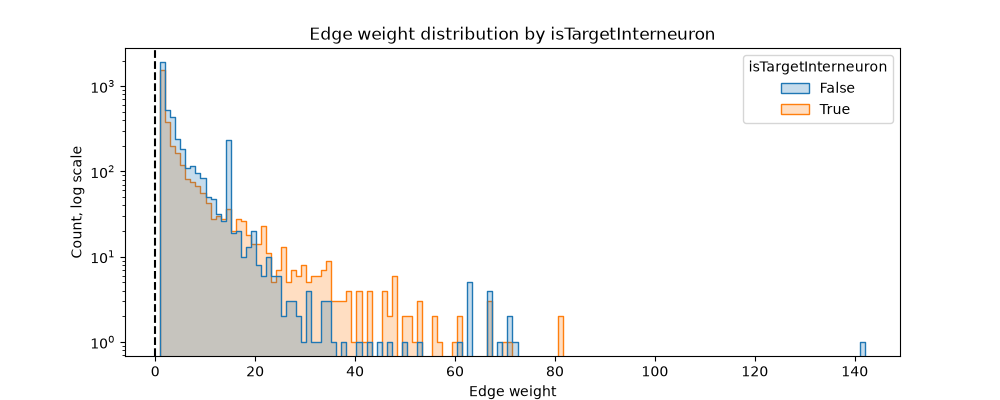

# Homework #2: Collaborative Data Wrangling & EDA
DSE 511 – Fall 2026

# Dataset Information

    Source: OpenWorm Hermaphrodite Modified Edgelist
    https://github.com/openworm/ConnectomeToolbox/blob/main/cect/data/herm_full_edgelist_MODIFIED.csv

    Date accessed: 9/8/26

    Description: The data set is a list of synapses and their weights in the connectome of the hermaphrodite *C. elegans*.

    Size: 240 kB, 7394 rows

    License: MIT license

    References: 
    1. Neuron names: https://www.wormatlas.org/neurons/Individual%20Neurons/Neuronframeset.html
    2. OpenWorm Reference: https://openworm.org/ConnectomeToolbox/

# Methods
## Data Cleaning (Daniel Jackson Archer)

    1. Checked dimensions of dataset
    2. Checked for missing values and duplicate values
    3. Created a feature `isElectrical` that casts `Type` feature from categorical data to boolean data
    4. Created `isSourceLeft`, `isSourceRight`, `isTargetLeft`, and `isTargetRight` columns for synapses based on descriptions of neurons from reference [1]
    5. Created `isSourceMotorNeuron`, `isTargetMotorNeuron`, `isSourceInterneuron`, and `isTargetInterneuron` features by cross referencing neuron names with reference [1] using regex patterns

    Tools/libraries used: pandas, regex, reference [1]

## Exploratory Data Analysis (Rayan Afsar)
EDA was performed with pandas, matplotlib, and seaborn, where pandas provided summary statistics and matplotlib & seaborn were used for data visualization.

The summary statistics were based on the one numeric variable, `Weight`, which corresponds to the edge weight of a single connection. This was calculated for the whole connectome, as well as for each of the engineered fields.

| Count | Mean | Median | Standard Deviation | Min | Max |
| ----- | ---- | ------ | ------------------ | --- | --- |
| 7394 | 5.38 | 3 | 7.56 | 1 | 142 |

For visualization of the data, I used a histogram for the relation between all connections and their edge weight. I then used overlaid histograms for each of the engineered fields to compare the distributions for True and False values. Finally, I employed a heatmap to see if there were potential relationships between different engineered categories.

Overall, the distribution of connections, regardless of their category, followed a $\text{Gamma}$ distribution, which was expected, and which was so heavily weighted toward the low end of the distribution that I had to use a log scale to visualize it beyond an edge weight of roughly 15. 

# Results

In general, connections had the same Gamma distribution in terms of their connection weight, although there were more heavily weighted connections (weight > 20) that were chemical as opposed to electrical. Interestingly, there is a major cluster of electrical connections that had a weight of 14 (> 200 connections), although we didn't dive further as to why that is. Also, most engineered fields did not have very strong correlations with each other (r-values of $>\pm0.06$). Interestingly, the `isElectrical` field had the weakest correlation with all of the others.

# Collaboration Notes

    Jackson's contributions: data inspection, README initialization, data cleaning and deduplication checks, feature engineering

    Rayan's contributions: repo setup, EDA, and data visualization

    Both: documentation, merge conflict, dataset search

# Reproducibility Instructions

To look at the script, open `DSE511_HW2.ipynb` with your favorite app for notebooks. The outputs should be visible. 

Use conda/mamba to create an environment with the dependencies in requirements.txt in order to run the script. 
1. `conda create --name DSE-HW2-env`
2. `conda activate DSE-HW2-env`
3. `conda install --file requirements.txt`

